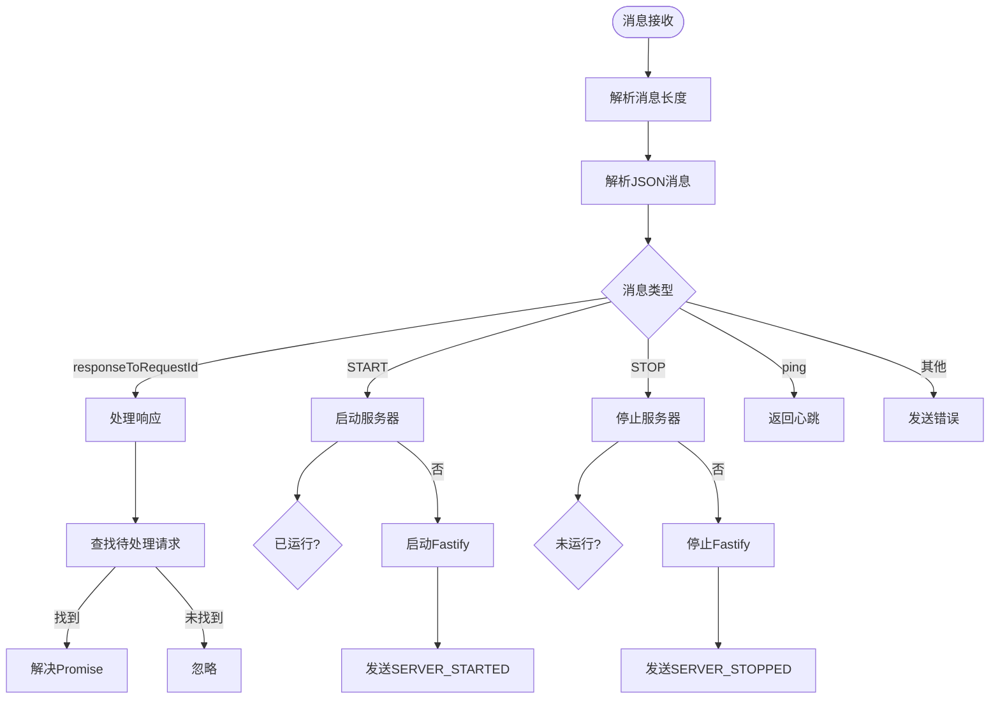
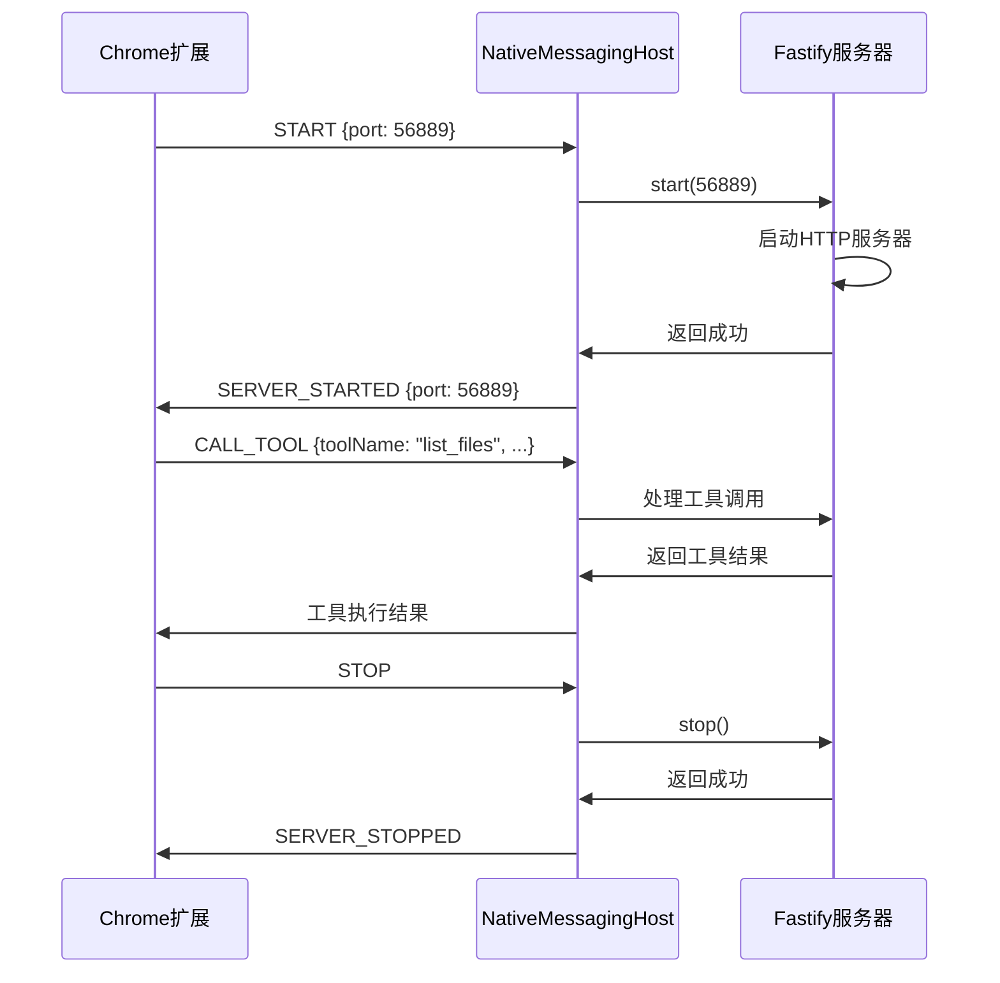
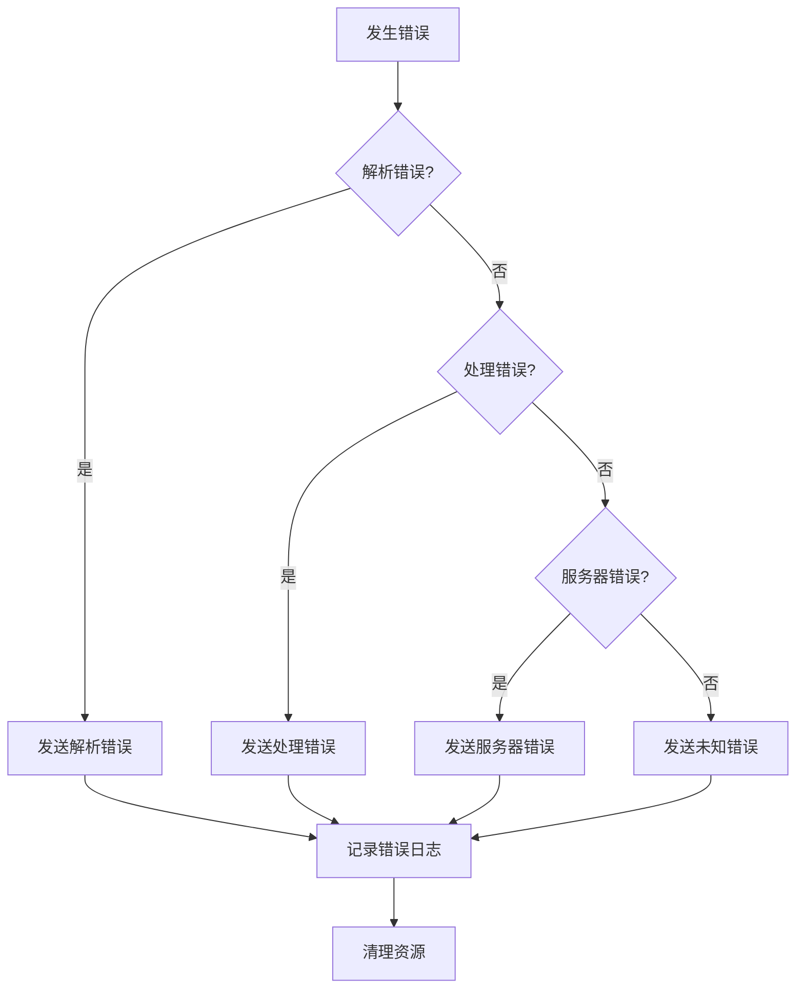

# native-messaging-host.ts 逐行详解

## 📁 文件概述

**文件**: `app/native-server/src/native-messaging-host.ts`  
**作用**: Chrome 扩展与本地 Node.js 服务器的原生消息通信桥梁  
**核功能**: 消息解析、路由、请求-响应管理、服务器生命周期控制

## 📋 逐行详细解读

### 1. 导入依赖 (1-6行)

```typescript
import { stdin, stdout } from 'process'; // Node.js 标准输入输出流
import { Server } from './server'; // Fastify 服务器实例
import { v4 as uuidv4 } from 'uuid'; // 生成唯一请求ID
import { NativeMessageType } from 'chrome-mcp-shared'; // 消息类型常量
import { TIMEOUTS } from './constant'; // 超时配置
```

### 2. 接口定义 (7-11行)

```typescript
interface PendingRequest {
  resolve: (value: any) => void; // Promise 成功回调
  reject: (reason?: any) => void; // Promise 失败回调
  timeoutId: NodeJS.Timeout; // 超时定时器ID
}
```

### 3. 类定义 (13-266行)

#### 3.1 类属性和构造函数 (13-19行)

```typescript
export class NativeMessagingHost {
  private associatedServer: Server | null = null; // 关联的Fastify服务器
  private pendingRequests: Map<string, PendingRequest> = new Map(); // 待处理请求映射

  public setServer(serverInstance: Server): void {
    this.associatedServer = serverInstance; // 设置服务器关联
  }
}
```

#### 3.2 启动方法 (21-28行)

```typescript
public start(): void {
  try {
    this.setupMessageHandling();  // 设置消息处理
  } catch (error: any) {
    process.exit(1);  // 启动失败直接退出
  }
}
```

#### 3.3 消息处理设置 (30-66行)

```typescript
private setupMessageHandling(): void {
  let buffer = Buffer.alloc(0);    // 消息缓冲区
  let expectedLength = -1;         // 期望的消息长度

  stdin.on('readable', () => {
    let chunk;
    while ((chunk = stdin.read()) !== null) {
      buffer = Buffer.concat([buffer, chunk]);

      // 解析消息长度 (前4字节)
      if (expectedLength === -1 && buffer.length >= 4) {
        expectedLength = buffer.readUInt32LE(0);  // 小端字节序读取长度
        buffer = buffer.slice(4);                  // 移除长度字节
      }

      // 当缓冲区足够时解析完整消息
      if (expectedLength !== -1 && buffer.length >= expectedLength) {
        const messageBuffer = buffer.slice(0, expectedLength);
        buffer = buffer.slice(expectedLength);

        try {
          const message = JSON.parse(messageBuffer.toString());
          this.handleMessage(message);  // 处理消息
        } catch (error: any) {
          this.sendError(`Failed to parse message: ${error.message}`);
        }
        expectedLength = -1;  // 重置等待下一条消息
      }
    }
  });

  stdin.on('end', () => {
    this.cleanup();  // 标准输入结束，清理资源
  });

  stdin.on('error', () => {
    this.cleanup();  // 标准输入错误，清理资源
  });
}
```

#### 3.4 消息处理核心 (68-116行)

```typescript
private async handleMessage(message: any): Promise<void> {
  if (!message || typeof message !== 'object') {
    this.sendError('Invalid message format');
    return;
  }

  // 处理响应消息 (来自Chrome的回复)
  if (message.responseToRequestId) {
    const requestId = message.responseToRequestId;
    const pending = this.pendingRequests.get(requestId);

    if (pending) {
      clearTimeout(pending.timeoutId);  // 清除超时
      if (message.error) {
        pending.reject(new Error(message.error));  // 拒绝Promise
      } else {
        pending.resolve(message.payload);  // 解决Promise
      }
      this.pendingRequests.delete(requestId);  // 移除已处理请求
    }
    return;  // 响应消息处理完成
  }

  // 处理指令消息 (来自Chrome的指令)
  try {
    switch (message.type) {
      case NativeMessageType.START:
        await this.startServer(message.payload?.port || 3000);
        break;
      case NativeMessageType.STOP:
        await this.stopServer();
        break;
      case 'ping_from_extension':  // 心跳检测
        this.sendMessage({ type: 'pong_to_extension' });
        break;
      default:
        this.sendError(`Unknown message type: ${message.type || 'no type'}`);
    }
  } catch (error: any) {
    this.sendError(`Failed to handle directive message: ${error.message}`);
  }
}
```

#### 3.5 请求-响应管理 (118-147行)

```typescript
/**
 * 发送请求到 Chrome 并等待响
 * 实现 Promise-based 的异步通信
 */
public sendRequestToExtensionAndWait(
  messagePayload: any,
  messageType: string = 'request_data',
  timeoutMs: number = TIMEOUTS.DEFAULT_REQUEST_TIMEOUT,
): Promise<any> {
  return new Promise((resolve, reject) => {
    const requestId = uuidv4();  // 生成唯一请求ID

    const timeoutId = setTimeout(() => {
      this.pendingRequests.delete(requestId);
      reject(new Error(`Request timed out after ${timeoutMs}ms`));
    }, timeoutId);

    // 存储 Promise 的 resolve/reject 函数
    this.pendingRequests.set(requestId, { resolve, reject, timeoutId });

    // 发送带请求ID的消息到 Chrome
    this.sendMessage({
      type: messageType,
      payload: messagePayload,
      requestId: requestId,
    });
  });
}
```

#### 3.6 服务器控制 (149-203行)

```typescript
/**
 * 启动 Fastify 服务器
 */
private async startServer(port: number): Promise<void> {
  if (!this.associatedServer) {
    this.sendError('Internal error: server instance not set');
    return;
  }

  try {
    if (this.associatedServer.isRunning) {
      this.sendMessage({
        type: NativeMessageType.ERROR,
        payload: { message: 'Server is already running' },
      });
      return;
    }

    await this.associatedServer.start(port, this);

    this.sendMessage({
      type: NativeMessageType.SERVER_STARTED,
      payload: { port },
    });
  } catch (error: any) {
    this.sendError(`Failed to start server: ${error.message}`);
  }
}

/**
 * 停止 Fastify 服务器
 */
private async stopServer(): Promise<void> {
  if (!this.associatedServer) {
    this.sendError('Internal error: server instance not set');
    return;
  }

  try {
    if (!this.associatedServer.isRunning) {
      this.sendMessage({
        type: NativeMessageType.ERROR,
        payload: { message: 'Server is not running' },
      });
      return;
    }

    await this.associatedServer.stop();
    this.sendMessage({ type: NativeMessageType.SERVER_STOPPED });
  } catch (error: any) {
    this.sendError(`Failed to stop server: ${error.message}`);
  }
}
```

#### 3.7 消息发送 (205-227行)

```typescript
/**
 * 发送消息到 Chrome 扩展
 * 遵循 Chrome 原生消息协议
 */
public sendMessage(message: any): void {
  try {
    const messageString = JSON.stringify(message);
    const messageBuffer = Buffer.from(messageString);
    const headerBuffer = Buffer.alloc(4);
    headerBuffer.writeUInt32LE(messageBuffer.length, 0);  // 写入消息长度

    // 原子性写入：长度 + 消息内容
    stdout.write(Buffer.concat([headerBuffer, messageBuffer]), (err) => {
      if (err) {
        // 处理写入错误
      }
    });
  } catch (error: any) {
    // 处理 JSON 序列化或 Buffer 操作错误
  }
}
```

#### 3.8 错误处理 (229-237行)

```typescript
private sendError(errorMessage: string): void {
  this.sendMessage({
    type: NativeMessageType.ERROR_FROM_NATIVE_HOST,
    payload: { message: errorMessage },
  });
}
```

#### 3.9 资源清理 (239-266行)

```typescript
private cleanup(): void {
  // 拒绝所有待处理请求
  this.pendingRequests.forEach((pending) => {
    clearTimeout(pending.timeoutId);
    pending.reject(new Error('Native host is shutting down or Chrome disconnected.'));
  });
  this.pendingRequests.clear();

  // 停止关联的服务器
  if (this.associatedServer && this.associatedServer.isRunning) {
    this.associatedServer
      .stop()
      .then(() => process.exit(0))
      .catch(() => process.exit(1));
  } else {
    process.exit(0);
  }
}
```

### 4. 单例式 (267-269行)

```typescript
const nativeMessagingHostInstance = new NativeMessagingHost();
export default nativeMessagingHostInstance; // 单例导出
```

## 🔄 消息处理流程图

### 4.1 整体消息处理流程



### 4.2 请求-响应序列图



### 4.3 错误处流程



## 🎯 设计特点

### 1. **协议严格遵循**

- 严格按照 Chrome 原生消息协议实现
- 4字节长度 + JSON消息格式
- 小端字节序处理

### 2. **异步非阻塞**

- Promise-based 异步通信
- 事件驱动的消息处理
- 非阻塞的 I/O 操作

### 3. **请求-响应模式**

- UUID 生成的唯一请求ID
- 待处理请求状态管理
- 超时机制防止挂起

### 4. **资源管理**

- 完善的内存清理
- 超时请求自动清理
- 优雅关闭流程

### 5. **错误隔离**

- 单点故障不影响整体
- 详细的错误信息
- 优雅降级处理

## 🔍 关键配置

### 超时设置

```typescript
// 来自 constant.ts
TIMEOUTS = {
  DEFAULT_REQUEST_TIMEOUT: 15000, // 默认请求超时: 15秒
  EXTENSION_REQUEST_TIMEOUT: 20000, // 扩展请求超时: 20秒
  PROCESS_DATA_TIMEOUT: 20000, // 处理数据超时: 20秒
};
```

### 消息类型

```typescript
// 来自 chrome-mcp-shared
NativeMessageType = {
  START: 'START',
  STOP: 'STOP',
  SERVER_STARTED: 'SERVER_STARTED',
  SERVER_STOPPED: 'SERVER_STOPPED',
  ERROR: 'ERROR',
  ERROR_FROM_NATIVE_HOST: 'ERROR_FROM_NATIVE_HOST',
};
```

这个文件是整个系统的**通信核心**，实现了 Chrome 扩展与本地 Node.js 服务之间的可靠双向通信。
