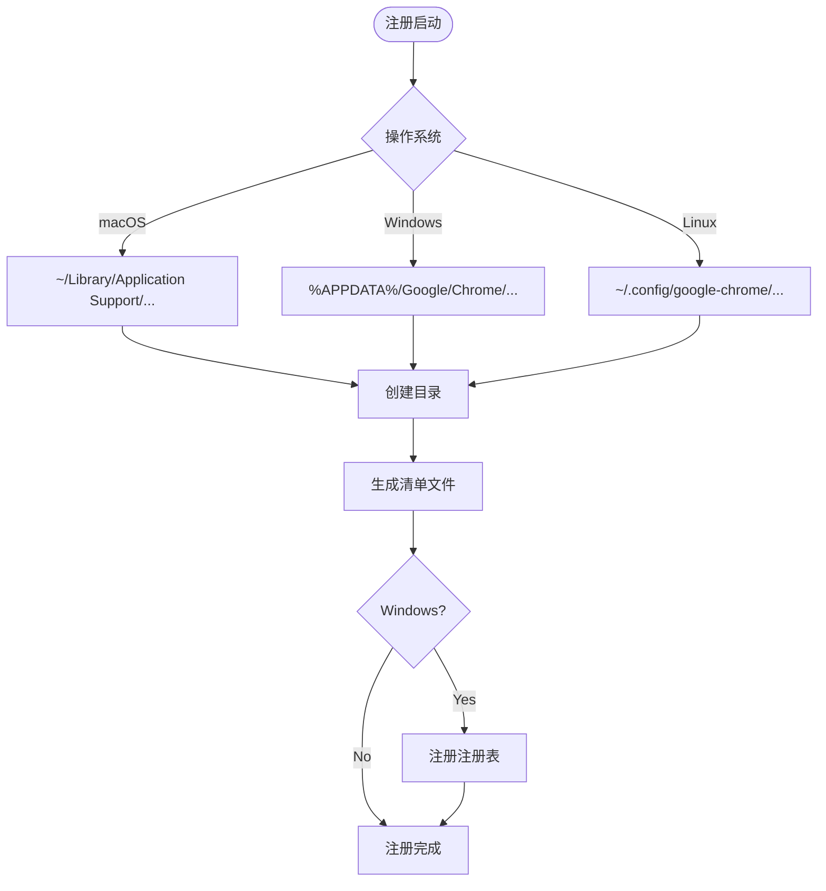
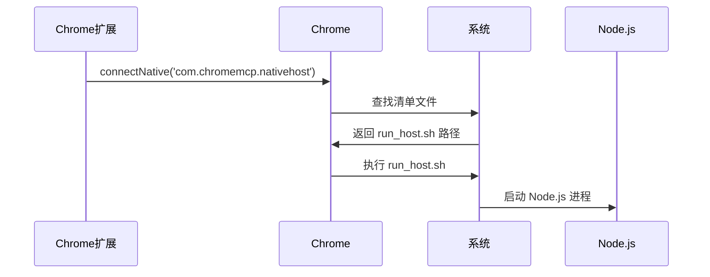
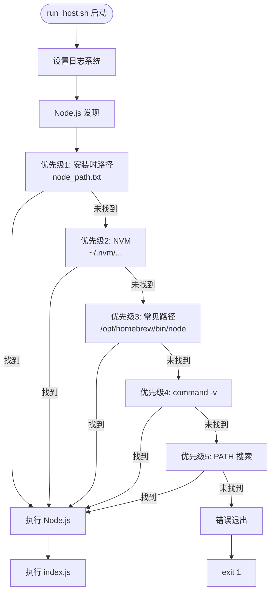
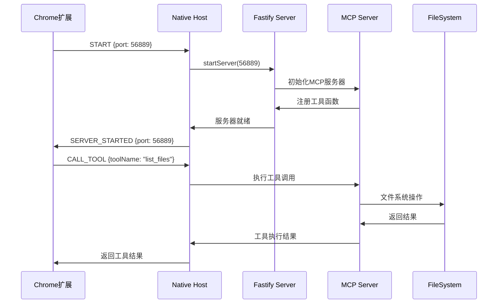

# Native Server 完整启动流程详解

native-server 启动后的完整行为分析

基于代码分析，Node.js 进程启动后执行了以下关键操作：

📋 启动流程总览

flowchart TD
Start([Node.js 进程启动]) --> Index[执行 index.ts]
Index --> CreateServer[创建 Server 实例]
CreateServer --> CreateNativeHost[创建 NativeMessagingHost]
CreateNativeHost --> Bind[双向关联设置]
Bind --> StartNative[启动原生消息监听]
StartNative --> WaitMessage[等待 Chrome 消息]

      WaitMessage --> ReceiveStart{收到 START 消息?}
      ReceiveStart --> |是| StartFastify[启动 Fastify 服务器]
      ReceiveStart --> |否| ContinueWait

      StartFastify --> SetupMCP[设置 MCP 服务器]
      SetupMCP --> Ready[服务器就绪]
      Ready --> ReadyMessage[发送 SERVER_STARTED]

🔍 详细行为分解

1. 初始化阶段

文件: app/native-server/src/index.ts:1-36
// 创建核心组件
const server = new Server(); // Fastify 服务器
const nativeMessagingHost = new NativeMessagingHost(server); // 原生消息主机
server.setNativeHost(nativeMessagingHost); // 双向关联
nativeMessagingHost.start(); // 开始监听

2. 原生消通信建立

文件: app/native-server/src/native-messaging-host.ts:21-66

- 协议格式: 4字节长度 + JSON消息
- 输入: 标准输入(stdin)
- 输出: 标准输出(stdout)
- 消息类型: START, STOP, CALL_TOOL, ping_from_extension

3. MCP服务器初始化

文件: app/native-server/src/mcp/mcp-server.ts:6-24
// MCP服务器配置
const mcpServer = new Server({
name: 'ChromeMcpServer',
version: '1.0.0',
}, {
capabilities: { tools: {} },
});

// 注册工具
setupTools(mcpServer); // 注册 list_files, read_file, write_file 等工具

4. 消息处理循环

文件: app/native-server/src/native-messaging-host.ts:67-116

sequenceDiagram
Chrome扩展->>Native Host: START {port: 3000}
Native Host->>Server: startServer(3000)
Server->>MCP Server: 初始化MCP工具
MCP Server-->>Server: 工具就绪
Server-->>Native Host: 服务器启动成功
Native Host-->>Chrome扩展: SERVER_STARTED {port: 3000}

      Chrome扩展->>Native Host: CALL_TOOL {toolName: "list_files"}
      Native Host->>MCP Server: 执行工具调用
      MCP Server-->>Native Host: 返回结果
      Native Host-->>Chrome扩展: 工具执行结果

5. 服务配置

文件: app/native-server/src/server/index.ts:238-259

- 端口: 56889 (可配置)
- 主机: 127.0.0.1
- CORS: 允许所有来源
- 端点:
  - /sse - Server-Sent Events
  - /mcp - Streamable HTTP
  - /tools - 工具列表

6. 工具注册

文件: app/native-server/src/mcp/tools.ts
// 注册的工具类型

- list_files: 列目录文件
- read_file: 读取文件内容
- write_file: 写入文件
- search_files: 搜索文件
- get_file_info: 获取文件信息
- execute_command: 执行shell命令

🎯 实际运行示例

当 Chrome 扩展发起连接时：

1. Chrome: chrome.runtime.connectNative('com.chromemcp.nativehost')
2. run_host.sh 启动 Node.js
3. index.ts 初始化 Server + NativeMessagingHost
4. 等待 Chrome 发送 START 消息
5. 启动 Fastify 服务器监听 56889
6. 注册所有 MCP 工具
7. 返回 SERVER_STARTED 确认
8. 开始处理工具调用

🔧 关键行为总结

| 阶段   | 行为                              | 目的          |
| ------ | --------------------------------- | ------------- |
| 初始化 | 创建 Server + NativeMessagingHost | 建立双向通信  |
| 监听   | 读取 stdin 的 Chrome 消息         | 接收扩展指令  |
| 启动   | Fastify + MCP 服务器              | 提供 HTTP API |
| 注册   | 设置工具处理函数                  | 支持文件操作  |
| 响应   | 处理 CALL_TOOL 消息               | 执行具体工具  |

简单来说：启动后创建了一个完整的 MCP 服务器，监听 Chrome 扩展的指令，并通过 HTTP 提供工具调用能力。

## 🎯 概述

native-server 是一个基于 Node.js 的 MCP 服务器，通过 Chrome 的 Native Messaging 协议与 Chrome 扩展通信，提供文件系统操作能力。

## 📋 完整启动流程

### 1. 注册阶段

#### 1.1 注册触发

```bash
# 开发环境
npm run register:dev

# 生产环境
npm install  # postinstall 自动注册
```

#### 1.2 注册过程



#### 1.3 生成文件

- **清单文件**: `com.chromemcp.nativehost.json`
- **内容示例**:

```json
{
  "name": "com.chromemcp.nativehost",
  "description": "Node.js Host for Browser Bridge Extension",
  "path": "/absolute/path/to/run_host.sh",
  "type": "stdio",
  "allowed_origins": ["chrome-extension://jonikfjlgfmhcgcohkfhfebhoakgblfh/"]
}
```

### 2. Chrome 扩展触发启动

#### 2.1 扩展代码

```typescript
// Chrome 扩展 background script
chrome.runtime.connectNative('com.chromemcp.nativehost');
```

#### 2.2 Chrome 查找流程



### 3. run_host.sh 执行流程

#### 3.1 智能 Node.js 发现



#### 3.2 日志系统

- **日志目录**: `app/native-server/dist/logs/`
- **日志文件**: `native_host_wrapper_macos_YYYYMMDD_HHMMSS.log`
- **错误日志**: `native_host_stderr_macos_YYYYMMDD_HHMMSS.log`

### 4. Node.js 进程启动后的行为

#### 4.1 初始化阶段

```typescript
// app/native-server/src/index.ts
const server = new Server(); // 创建 Fastify 服务器
const nativeMessagingHost = new NativeMessagingHost(server);
server.setNativeHost(nativeMessagingHost); // 双向关联
nativeMessagingHost.start(); // 开始监听
```

#### 4.2 消息处理循环



#### 4.3 服务器配置

- **端口**: 56889 (可配置)
- **主机**: 127.0.0.1
- **CORS**: 允许所有来源
- **会话**: UUID 生成的会话ID

#### 4.4 支持的工具

```typescript
// 注册的工具列表
- list_files: 列目录文件
- read_file: 读取文件内容
- write_file: 写入文件
- search_files: 搜索文件
- get_file_info: 获取文件信息
- execute_command: 执行shell命令
```

### 5. 通信协议

#### 5.1 原生消息协议

- **格式**: 4字节长度 + JSON消息
- **传输**: 标准输入/输出(stdio)
- **超时**: 15-30秒

#### 5.2 消息类型

```typescript
// 扩展 -> 主机
START; // 启动服务器
STOP; // 停止服务器
CALL_TOOL; // 调用工具
ping_from_extension;

// 主机 -> 扩展
SERVER_STARTED; // 服务器启动成功
SERVER_STOPPED; // 服务器停止成功
TOOL_RESPONSE; // 工具执行结果
pong_to_extension;
```

### 6. 错误处理和生命周期

#### 6.1 信号处理

- **SIGINT**: 优雅退出
- **SIGTERM**: 强制退出
- **uncaughtException**: 未捕获异常处理
- **unhandledRejection**: 未处理Promise拒绝

#### 6.2 资源清理

- 关闭所有待处理请求
- 停止服务器监听
- 清理临时文件
- 发送关闭确认

### 7. 实际运行示例

#### 7.1 启动日志

```bash
# run_host.sh 日志内容
--- Wrapper script called at 2024-01-15 14:30:25 ---
SCRIPT_DIR: /Users/doudoufei/.../mcp-chrome/app/native-server/dist
Using Node executable: /Users/doudoufei/.volta/tools/image/node/22.17.1/bin/node
Node version: v22.17.1
Executing: /Users/doudoufei/.volta/tools/image/node/22.17.1/bin/node /Users/doudoufei/.../mcp-chrome/app/native-server/dist/index.js
```

#### 7.2 服务器启动确认

```json
// 发送到 Chrome 扩展的消息
{
  "type": "SERVER_STARTED",
  "payload": {
    "port": 56889,
    "host": "127.0.0.1"
  }
}
```

## 🎯 总结

native-server 通过以下流程实现了 Chrome 扩展与本地文件系统的无缝集成：

1. **注册**: 自动注册为 Chrome Native Messaging 主机
2. **发现**: 智能查找 Node.js 环境
3. **通信**: 通过 stdio 与 Chrome 扩展通信
4. **服务**: 启动 MCP 服务器提供文件操作能力
5. **工具**: 支持完整的文件系统操作

整个流程无需手动配置，实现了 **一键安装，即开即用** 的体验。
