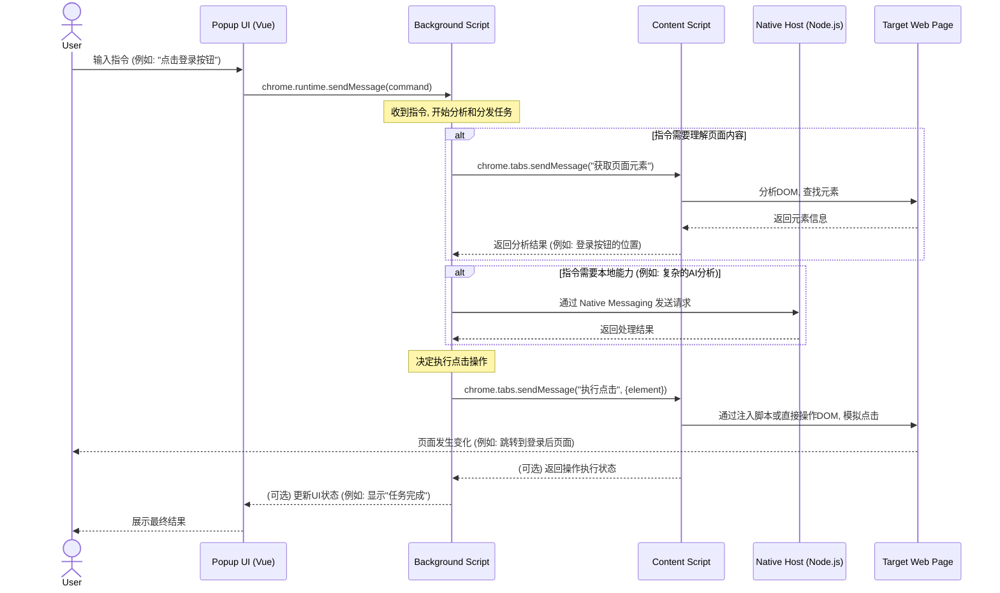
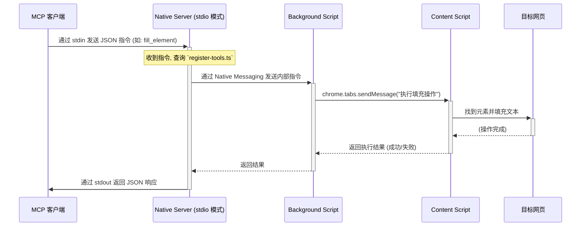

## 🎯 什么是 Chrome MCP Server？

Chrome MCP Server 是一个基于chrome插件的 **模型上下文协议 (MCP) 服务器**，它将您的 Chrome 浏览器功能暴露给 Claude 等 AI 助手，实现复杂的浏览器自动化、内容分析和语义搜索等。与传统的浏览器自动化工具（如playwright）不同，**Chrome MCP server**直接使用您日常使用的chrome浏览器，基于现有的用户习惯和配置、登录态，让各种大模型或者各种chatbot都可以接管你的浏览器，真正成为你的如常助手

## ✨ 核心特性

- 😁 **chatbot/模型无关**：让任意你喜欢的llm或chatbot客户端或agent来自动化操作你的浏览器
- ⭐️ **使用你原本的浏览器**：无缝集成用户本身的浏览器环境（你的配置、登录态等）
- 💻 **完全本地运行**：纯本地运行的mcp server，保证用户隐私
- 🚄 **Streamable http**：Streamable http的连接方式
- 🏎 **跨标签页** 跨标签页的上下文
- 🧠 **语义搜索**：内置向量数据库和本地小模型，智能发现浏览器标签页内容
- 🔍 **智能内容分析**：AI 驱动的文本提取和相似度匹配
- 🌐 **20+ 工具**：支持截图、网络监控、交互操作、书签管理、浏览历史等20多种工具
- 🚀 **SIMD 加速 AI**：自定义 WebAssembly SIMD 优化，向量运算速度提升 4-8 倍

                                                |

## 🚀 快速开始

### 环境要求

- Node.js >= 18.19.0 和 （npm 或 pnpm）
- Chrome/Chromium 浏览器

### 安装步骤

1. **从github上下载最新的chrome扩展**

下载地址：https://github.com/hangwin/mcp-chrome/releases

2. **全局安装mcp-chrome-bridge**

npm

```bash
npm install -g mcp-chrome-bridge
```

pnpm

```bash
# 方法1：全局启用脚本（推荐）
pnpm config set enable-pre-post-scripts true
pnpm install -g mcp-chrome-bridge

# 方法2：如果 postinstall 没有运行，手动注册
pnpm install -g mcp-chrome-bridge
mcp-chrome-bridge register
```

> 注意：pnpm v7+ 默认禁用 postinstall 脚本以提高安全性。`enable-pre-post-scripts` 设置控制是否运行 pre/post 安装脚本。如果自动注册失败，请使用上述手动注册命令。

3. **加载 Chrome 扩展**
   - 打开 Chrome 并访问 `chrome://extensions/`
   - 启用"开发者模式"
   - 点击"加载已解压的扩展程序"，选择 `your/dowloaded/extension/folder`
   - 点击插件图标打开插件，点击连接即可看到mcp的配置
     

### 在支持MCP协议的客户端中使用

#### 使用streamable http的方式连接（👍🏻推荐）

将以下配置添加到客户端的 MCP 配置中以cherryStudio为例：

> 推荐用streamable http的连接方式

```json
{
  "mcpServers": {
    "chrome-mcp-server": {
      "type": "streamableHttp",
      "url": "http://127.0.0.1:12306/mcp"
    }
  }
}
```

#### 使用stdio的方式连接（备选）

假设你的客户端仅支持stdio的连接方式，那么请使用下面的方法：

1. 先查看你刚刚安装的npm包的安装位置

```sh
# npm 查看方式
npm list -g mcp-chrome-bridge
# pnpm 查看方式
pnpm list -g mcp-chrome-bridge
```

假设上面的命令输出的路径是：/Users/xxx/Library/pnpm/global/5
那么你的最终路径就是：/Users/xxx/Library/pnpm/global/5/node_modules/mcp-chrome-bridge/dist/mcp/mcp-server-stdio.js

2. 把下面的配置替换成你刚刚得到的最终路径

```json
{
  "mcpServers": {
    "chrome-mcp-stdio": {
      "command": "npx",
      "args": [
        "node",
        "/Users/xxx/Library/pnpm/global/5/node_modules/mcp-chrome-bridge/dist/mcp/mcp-server-stdio.js"
      ]
    }
  }
}
```

比如：在augment中的配置如下：


## 🛠️ 可用工具

完整工具列表：[完整工具列表](docs/TOOLS_zh.md)

<details>
<summary><strong>📊 浏览器管理 (6个工具)</strong></summary>

- `get_windows_and_tabs` - 列出所有浏览器窗口和标签页
- `chrome_navigate` - 导航到 URL 并控制视口
- `chrome_close_tabs` - 关闭特定标签页或窗口
- `chrome_go_back_or_forward` - 浏览器导航控制
- `chrome_inject_script` - 向网页注入内容脚本
- `chrome_send_command_to_inject_script` - 向已注入的内容脚本发送指令
</details>

<details>
<summary><strong>📸 截图和视觉 (1个工具)</strong></summary>

- `chrome_screenshot` - 高级截图捕获，支持元素定位、全页面和自定义尺寸
</details>

<details>
<summary><strong>🌐 网络监控 (4个工具)</strong></summary>

- `chrome_network_capture_start/stop` - webRequest API 网络捕获
- `chrome_network_debugger_start/stop` - Debugger API 包含响应体
- `chrome_network_request` - 发送自定义 HTTP 请求
</details>

<details>
<summary><strong>🔍 内容分析 (4个工具)</strong></summary>

- `search_tabs_content` - AI 驱动的浏览器标签页语义搜索
- `chrome_get_web_content` - 从页面提取 HTML/文本内容
- `chrome_get_interactive_elements` - 查找可点击元素
- `chrome_console` - 捕获和获取浏览器标签页的控制台输出
</details>

<details>
<summary><strong>🎯 交互操作 (3个工具)</strong></summary>

- `chrome_click_element` - 使用 CSS 选择器点击元素
- `chrome_fill_or_select` - 填充表单和选择选项
- `chrome_keyboard` - 模拟键盘输入和快捷键
</details>

<details>
<summary><strong>📚 数据管理 (5个工具)</strong></summary>

- `chrome_history` - 搜索浏览器历史记录，支持时间过滤
- `chrome_bookmark_search` - 按关键词查找书签
- `chrome_bookmark_add` - 添加新书签，支持文件夹
- `chrome_bookmark_delete` - 删除书签
</details>

### 项目流程时序图



### 核心：`native-server` 的双重角色


