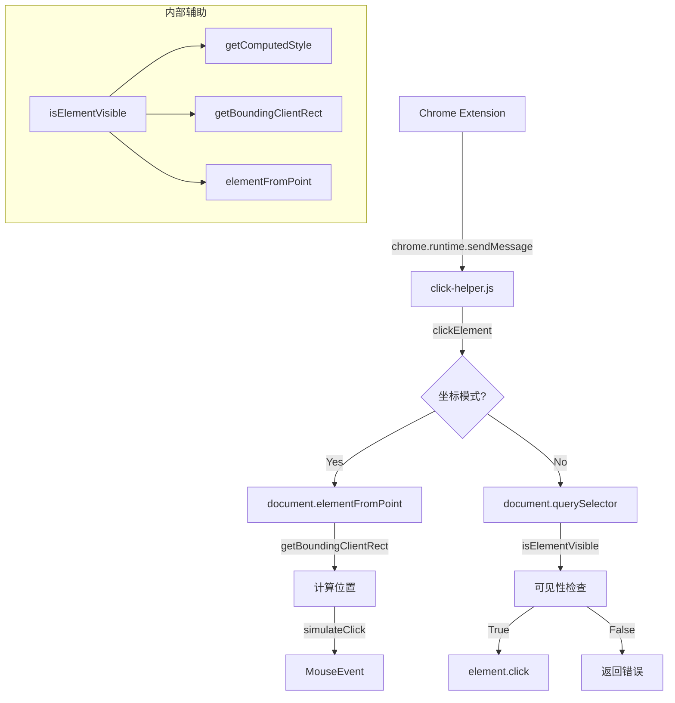

# 🔍 click-helper.js 逐行注释

## 📋 文件概览
**作用：** 页面点击操作引擎，支持选择器点击和坐标点击
**被谁调用：** Chrome扩展背景脚本通过 `chrome.tabs.sendMessage()` 调用

---

## 1. 头部声明与防重复
```javascript
/* eslint-disable */
// 禁用ESLint，内容脚本需要特殊处理

// click-helper.js
// 页面点击操作处理脚本

if (window.__CLICK_HELPER_INITIALIZED__) {
  // 检查是否已初始化，防止重复加载
  // Already initialized, skip
} else {
  window.__CLICK_HELPER_INITIALIZED__ = true;
  // 设置全局标志，标记已加载
```

## 2. 核心函数 - clickElement
```javascript
  /**
   * 点击元素的核心函数
   * @param {string} selector - CSS选择器
   * @param {boolean} waitForNavigation - 是否等待页面跳转
   * @param {number} timeout - 超时时间（毫秒）
   * @param {Object} coordinates - 坐标对象{x, y}
   * @returns {Promise<Object>} 点击结果
   */
  async function clickElement(
    selector,
    waitForNavigation = false,
    timeout = 5000,
    coordinates = null,
  ) {
```

### 2.1 坐标点击分支
```javascript
    try {
      let element = null;
      let elementInfo = null;
      let clickX, clickY;

      if (coordinates && typeof coordinates.x === 'number' && typeof coordinates.y === 'number') {
        // 坐标模式：直接通过坐标找元素
        clickX = coordinates.x;
        clickY = coordinates.y;
        
        element = document.elementFromPoint(clickX, clickY);
        // 根据坐标找到最上层元素

        if (element) {
          const rect = element.getBoundingClientRect();
          elementInfo = {
            tagName: element.tagName,
            id: element.id,
            className: element.className,
            text: element.textContent?.trim().substring(0, 100) || '',
            href: element.href || null,
            type: element.type || null,
            isVisible: true,
            rect: {
              x: rect.x, y: rect.y, width: rect.width, height: rect.height,
              top: rect.top, right: rect.right, bottom: rect.bottom, left: rect.left,
            },
            clickMethod: 'coordinates', // 标记为坐标点击
            clickPosition: { x: clickX, y: clickY },
          };
        } else {
          elementInfo = {
            clickMethod: 'coordinates',
            clickPosition: { x: clickX, y: clickY },
            warning: 'No element found at the specified coordinates',
          };
        }
      } else {
        // 选择器模式：通过CSS选择器找元素
        element = document.querySelector(selector);
        if (!element) {
          return {
            error: `Element with selector "${selector}" not found`,
          };
        }

        const rect = element.getBoundingClientRect();
        elementInfo = {
          tagName: element.tagName,
          id: element.id,
          className: element.className,
          text: element.textContent?.trim().substring(0, 100) || '',
          href: element.href || null,
          type: element.type || null,
          isVisible: true,
          rect: {
            x: rect.x, y: rect.y, width: rect.width, height: rect.height,
            top: rect.top, right: rect.right, bottom: rect.bottom, left: rect.left,
          },
          clickMethod: 'selector',
        };

        // 滚动元素到视图中央
        element.scrollIntoView({ behavior: 'auto', block: 'center', inline: 'center' });
        await new Promise((resolve) => setTimeout(resolve, 100)); // 等待滚动完成
        
        elementInfo.isVisible = isElementVisible(element);
        if (!elementInfo.isVisible) {
          return {
            error: `Element with selector "${selector}" is not visible`,
            elementInfo,
          };
        }

        // 计算元素中心点坐标用于点击
        const updatedRect = element.getBoundingClientRect();
        clickX = updatedRect.left + updatedRect.width / 2;
        clickY = updatedRect.top + updatedRect.height / 2;
      }
```

### 2.2 导航等待机制
```javascript
      let navigationPromise;
      if (waitForNavigation) {
        // 创建页面跳转监听器
        navigationPromise = new Promise((resolve) => {
          const beforeUnloadListener = () => {
            window.removeEventListener('beforeunload', beforeUnloadListener);
            resolve(true); // 页面即将跳转
          };
          window.addEventListener('beforeunload', beforeUnloadListener);

          // 超时保护
          setTimeout(() => {
            window.removeEventListener('beforeunload', beforeUnloadListener);
            resolve(false); // 超时无跳转
          }, timeout);
        });
      }
```

### 2.3 执行点击
```javascript
      // 执行实际点击
      if (element && elementInfo.clickMethod === 'selector') {
        element.click(); // 直接点击元素
      } else {
        simulateClick(clickX, clickY); // 模拟坐标点击
      }

      // 等待导航（如果需要）
      let navigationOccurred = false;
      if (waitForNavigation) {
        navigationOccurred = await navigationPromise;
      }

      return {
        success: true,
        message: 'Element clicked successfully',
        elementInfo,
        navigationOccurred,
      };
    } catch (error) {
      return {
        error: `Error clicking element: ${error.message}`,
      };
    }
  }
```

## 3. 模拟点击辅助函数
```javascript
  /**
   * 模拟鼠标点击指定坐标
   * @param {number} x - X坐标（相对于视口）
   * @param {number} y - Y坐标（相对于视口）
   */
  function simulateClick(x, y) {
    const clickEvent = new MouseEvent('click', {
      view: window,
      bubbles: true,      // 事件冒泡
      cancelable: true,   // 可取消
      clientX: x,         // 视口相对X坐标
      clientY: y,         // 视口相对Y坐标
    });

    const element = document.elementFromPoint(x, y);
    if (element) {
      element.dispatchEvent(clickEvent);
    } else {
      // 如果没有元素在坐标点，向document派发事件
      document.dispatchEvent(clickEvent);
    }
  }
```

## 4. 可见性检查函数
```javascript
  /**
   * 检查元素是否可见
   * @param {Element} element - 要检查的元素
   * @returns {boolean} 是否可见
   */
  function isElementVisible(element) {
    if (!element) return false;

    const style = window.getComputedStyle(element);
    
    // 检查CSS显示属性
    if (style.display === 'none' || style.visibility === 'hidden' || style.opacity === '0') {
      return false;
    }

    const rect = element.getBoundingClientRect();
    
    // 检查元素是否有尺寸
    if (rect.width === 0 || rect.height === 0) {
      return false;
    }

    // 检查元素是否在视口内
    if (
      rect.bottom < 0 ||
      rect.top > window.innerHeight ||
      rect.right < 0 ||
      rect.left > window.innerWidth
    ) {
      return false;
    }

    // 检查元素中心点是否可见（避免被其他元素遮挡）
    const centerX = rect.left + rect.width / 2;
    const centerY = rect.top + rect.height / 2;
    const elementAtPoint = document.elementFromPoint(centerX, centerY);
    
    if (!elementAtPoint) return false;

    return element === elementAtPoint || element.contains(elementAtPoint);
  }
```

## 5. 消息监听器
```javascript
  // 监听来自扩展的消息
  chrome.runtime.onMessage.addListener((request, _sender, sendResponse) => {
    if (request.action === 'clickElement') {
      // 处理点击请求
      clickElement(
        request.selector,
        request.waitForNavigation,
        request.timeout,
        request.coordinates,
      )
        .then(sendResponse) // 异步返回结果
        .catch((error) => {
          sendResponse({
            error: `Unexpected error: ${error.message}`,
          });
        });
      
      return true; // 标记异步响应
      
    } else if (request.action === 'chrome_click_element_ping') {
      // 健康检查响应
      sendResponse({ status: 'pong' });
      return false; // 同步响应
    }
  });
```

---

## 🔄 函数调用关系



---

## 📊 调用场景分析

| 场景 | 调用方 | 调用方式 | 参数示例 |
|---|---|---|---|
| 元素点击 | 背景脚本 | `chrome.tabs.sendMessage(tabId, {action: 'clickElement', selector: '#btn'})` | `{selector: '#login-btn'}` |
| 坐标点击 | 背景脚本 | `chrome.tabs.sendMessage(tabId, {action: 'clickElement', coordinates: {x: 100, y: 200}})` | `{coordinates: {x: 100, y: 200}}` |
| 等待导航 | 背景脚本 | `chrome.tabs.sendMessage(tabId, {action: 'clickElement', selector: '#link', waitForNavigation: true})` | `{waitForNavigation: true, timeout: 5000}` |
| 健康检查 | 背景脚本 | `chrome.tabs.sendMessage(tabId, {action: 'chrome_click_element_ping'})` | 无 |

---

## 🎯 关键特性

1. **双模式支持**：选择器点击和坐标点击
2. **智能滚动**：自动将元素滚动到可视区域
3. **导航检测**：可选的页面跳转等待
4. **可见性检查**：全面的元素可见性验证
5. **错误处理**：详细的错误信息和状态返回
6. **超时保护**：防止无限等待
7. **健康检查**：支持ping-pong机制