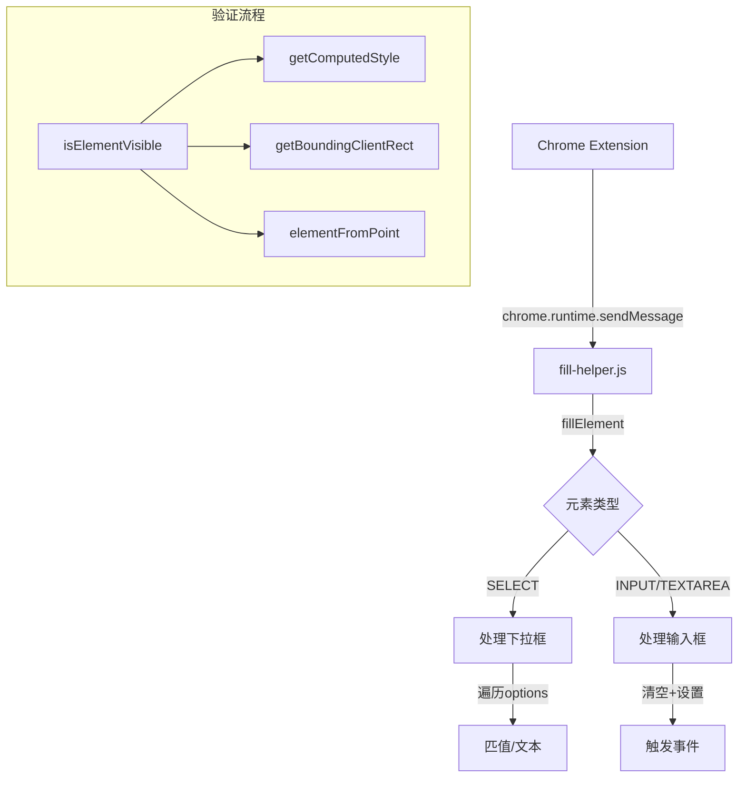

# 🔍 fill-helper.js 逐行注释

## 📋 文件概览
**作用：** 表单填充引擎，支持input、textarea、select元素的填充
**被谁调用：** Chrome扩展背景脚本通过 `chrome.tabs.sendMessage()` 调用

---

## 1. 头部声明与防重复
```javascript
/* eslint-disable */
// 禁用ESLint检查，内容脚本的特殊环境

// fill-helper.js
// 页面表单填充操作处理脚本

if (window.__FILL_HELPER_INITIALIZED__) {
  // 检查是否已初始化，防止重复加载
  // Already initialized, skip
} else {
  window.__FILL_HELPER_INITIALIZED__ = true;
  // 设置全局标志，标记已加载
```

## 2. 核心函数 - fillElement
```javascript
  /**
   * 填充表单元素的核心函数
   * @param {string} selector - CSS选择器
   * @param {string} value - 要填充的值
   * @returns {Promise<Object>} 填充结果
   */
  async function fillElement(selector, value) {
    try {
      // 查找目标元素
      const element = document.querySelector(selector);
      if (!element) {
        return {
          error: `Element with selector "${selector}" not found`,
        };
      }

      // 获取元素基本信息
      const rect = element.getBoundingClientRect();
      const elementInfo = {
        tagName: element.tagName,
        id: element.id,
        className: element.className,
        type: element.type || null,
        isVisible: isElementVisible(element),
        rect: {
          x: rect.x,
          y: rect.y,
          width: rect.width,
          height: rect.height,
          top: rect.top,
          right: rect.right,
          bottom: rect.bottom,
          left: rect.left,
        },
      };

      // 检查元素是否可见
      if (!elementInfo.isVisible) {
        return {
          error: `Element with selector "${selector}" is not visible`,
          elementInfo,
        };
      }

      // 验证元素类型是否可填充
      const validTags = ['INPUT', 'TEXTAREA', 'SELECT'];
      const validInputTypes = [
        'text', 'email', 'password', 'number', 'search', 'tel', 'url',
        'date', 'datetime-local', 'month', 'time', 'week', 'color',
      ];

      // 检查标签类型
      if (!validTags.includes(element.tagName)) {
        return {
          error: `Element with selector "${selector}" is not a fillable element (must be INPUT, TEXTAREA, or SELECT)`,
          elementInfo,
        };
      }

      // 检查input类型是否可填充
      if (
        element.tagName === 'INPUT' &&
        !validInputTypes.includes(element.type) &&
        element.type !== null
      ) {
        return {
          error: `Input element with selector "${selector}" has type "${element.type}" which is not fillable`,
          elementInfo,
        };
      }
```

## 3. 元素滚动与聚焦
```javascript
      // 滚动元素到视图中央
      element.scrollIntoView({ 
        behavior: 'auto', 
        block: 'center', 
        inline: 'center' 
      });
      await new Promise((resolve) => setTimeout(resolve, 100)); // 等待滚动完成

      // 聚焦元素，准备输入
      element.focus();
```

## 4. 不同类型元素的处理
```javascript
      // 根据元素类型执行不同的填充逻辑
      if (element.tagName === 'SELECT') {
        // 处理下拉选择框
        let optionFound = false;
        
        // 遍历所有选项，匹配值或文本
        for (const option of element.options) {
          if (option.value === value || option.text === value) {
            element.value = option.value;
            optionFound = true;
            break;
          }
        }

        if (!optionFound) {
          return {
            error: `No option with value or text "${value}" found in select element`,
            elementInfo,
          };
        }

        // 触发change事件，通知框架值已改变
        element.dispatchEvent(new Event('change', { bubbles: true }));
      } else {
        // 处理input和textarea元素
        
        // 清空当前值
        element.value = '';
        // 触发input事件，通知框架值已清空
        element.dispatchEvent(new Event('input', { bubbles: true }));

        // 设置新值
        element.value = value;

        // 触发input和change事件
        element.dispatchEvent(new Event('input', { bubbles: true }));
        element.dispatchEvent(new Event('change', { bubbles: true }));
      }

      // 失焦元素，完成输入
      element.blur();
```

## 5. 可见性检查函数
```javascript
  /**
   * 检查元素是否可见
   * @param {Element} element - 要检查的元素
   * @returns {boolean} 是否可见
   */
  function isElementVisible(element) {
    if (!element) return false;

    const style = window.getComputedStyle(element);
    
    // 检查CSS显示属性
    if (style.display === 'none' || style.visibility === 'hidden' || style.opacity === '0') {
      return false;
    }

    const rect = element.getBoundingClientRect();
    
    // 检查元素是否有尺寸
    if (rect.width === 0 || rect.height === 0) {
      return false;
    }

    // 检查元素是否在视口内
    if (
      rect.bottom < 0 ||
      rect.top > window.innerHeight ||
      rect.right < 0 ||
      rect.left > window.innerWidth
    ) {
      return false;
    }

    // 检查元素中心点是否可见（避免被遮挡）
    const centerX = rect.left + rect.width / 2;
    const centerY = rect.top + rect.height / 2;
    const elementAtPoint = document.elementFromPoint(centerX, centerY);
    
    if (!elementAtPoint) return false;

    return element === elementAtPoint || element.contains(elementAtPoint);
  }
```

## 6. 消息监听器
```javascript
  // 监听来自扩展的消息
  chrome.runtime.onMessage.addListener((request, _sender, sendResponse) => {
    if (request.action === 'fillElement') {
      // 处理填充请求
      fillElement(request.selector, request.value)
        .then(sendResponse) // 异步返回结果
        .catch((error) => {
          sendResponse({
            error: `Unexpected error: ${error.message}`,
          });
        });
      
      return true; // 标记异步响应
      
    } else if (request.action === 'chrome_fill_or_select_ping') {
      // 健康检查响应
      sendResponse({ status: 'pong' });
      return false; // 同步响应
    }
  });
```

---

## 🔄 函数调用关系



---

## 📊 调用场景分析

| 场景 | 调用方 | 调用方式 | 参数示例 |
|---|---|---|---|
| 文输入 | 背景脚本 | `chrome.tabs.sendMessage(tabId, {action: 'fillElement', selector: '#email', value: 'test@example.com'})` | `{selector: '#email', value: 'test@example.com'}` |
| 下拉选择 | 背景脚本 | `chrome.tabs.sendMessage(tabId, {action: 'fillElement', selector: '#country', value: 'China'})` | `{selector: '#country', value: 'China'}` |
| 文本域填充 | 背景脚本 | `chrome.tabs.sendMessage(tabId, {action: 'fillElement', selector: '#message', value: 'Hello World'})` | `{selector: '#message', value: 'Hello World'}` |
| 健康检查 | 背景脚本 | `chrome.tabs.sendMessage(tabId, {action: 'chrome_fill_or_select_ping'})` | 无 |

---

## 🎯 关键特性

1. **类型验证**：严格检查元素类型是否可填充
2. **输入类型检查**：验证input元素的type属性
3. **下拉框支持**：支持通过值或文本选择选项
4. **事件触发**：完整触发input和change事件
5. **可见性检查**：确保元素可见且可交互
6. **错误处理**：详细的错误信息和状态返回
7. **焦点管理**：自动聚焦和失焦元素
8. **滚动支持**：自动滚动元素到可视区域