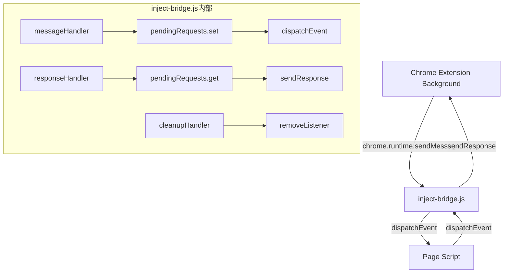

# 🔍 inject-bridge.js 逐行注释

## 📋 文件概览
**作用：** 通用桥接脚本，连接Chrome扩展与页面脚本的双向通信
**被谁调用：** Chrome扩展背景脚本通过 `chrome.tabs.sendMessage()` 调用

---

## 1. 头部声明与防重复
```javascript
/* eslint-disable */
// 禁用ESLint检查，内容脚本运行在特殊环境，标准规则不适用

(() => {
// IIFE立即执行函数，创建独立作用域，避免全污染

  // 防重复注入检查
  if (window.__INJECT_SCRIPT_TOOL_UNIVERSAL_BRIDGE_LOADED__) return;
  // 如果已加载，直接返回，防止重复初始化
  
  window.__INJECT_SCRIPT_TOOL_UNIVERSAL_BRIDGE_LOADED__ = true;
  // 设置全局标志，标记此桥接脚本已加载
```

## 2. 事件常量定义
```javascript
  const EVENT_NAME = {
    RESPONSE: 'chrome-mcp:response',   // 页面→扩展的响应事件名
    CLEANUP: 'chrome-mcp:cleanup',     // 清理事件名
    EXECUTE: 'chrome-mcp:execute',     // 扩展→页面的执行事件名
  };
```

## 3. 请求管理系统
```javascript
  const pendingRequests = new Map();
  // Map结构，存储待处理的异步请求
  // key: requestId（唯一标识符）
  // value: sendResponse回调函数（用于返回结果给扩展）
```

## 4. 消息处理器（核心）
```javascript
  const messageHandler = (request, _sender, sendResponse) => {
    // request: 来自扩展的消息对象
    // _sender: 消息发送者信息（未使用，用_占位）
    // sendResponse: 回调函数，用于异步响应
    
    // 4.1 生命周期清理命令处理
    if (request.type === EVENT_NAME.CLEANUP) {
      window.dispatchEvent(new CustomEvent(EVENT_NAME.CLEANUP));
      // 向页面广播清理信号，用户脚本可监听此事件进行清理
      
      sendResponse({ success: true });
      // 同步响应清理完成
      return true; // 表示异步响应，但实际是同步的
    }

    // 4.2 MAIN世界执行请求处理
    if (request.targetWorld === 'MAIN') {
      const requestId = `req-${Date.now()}-${Math.random()}`;
      // 生成唯一请求ID，格式：req-时间戳-随机数
      
      pendingRequests.set(requestId, sendResponse);
      // 存储回调函数，等待页面脚本响应
      
      window.dispatchEvent(
        new CustomEvent(EVENT_NAME.EXECUTE, {
          detail: {
            action: request.action,    // 要执行的动作
            payload: request.payload,  // 动作参数
            requestId: requestId,      // 请求ID，用于匹配响应
          },
        })
      );
      // 向页面广播执行事件，用户脚本监听后执行
      
      return true; // 标记异步响应，保持消息通道开放
    }
    
    // 注意：ISOLATED世界的请求由用户脚本直接处理，不经过此桥接
  };
```

## 5. 消息监听器注册
```javascript
  chrome.runtime.onMessage.addListener(messageHandler);
  // 注册监听器，接收来自Chrome扩展背景脚本的消息
```

## 6. 响应处理器
```javascript
  const responseHandler = (event) => {
    // event: 来自页面的自定义事件
    const { requestId, data, error } = event.detail;
    // 解构事件详情：请求ID、返回数据、错误信息
    
    if (pendingRequests.has(requestId)) {
      const sendResponse = pendingRequests.get(requestId);
      sendResponse({ data, error });
      // 调用存储的回调函数，将结果返回给扩展
      
      pendingRequests.delete(requestId);
      // 清理已完成的请求，防止内存泄露
    }
  };
  window.addEventListener(EVENT_NAME.RESPONSE, responseHandler);
  // 监听页面脚本的响应事件
```

## 7. 清理处理器
```javascript
  const cleanupHandler = () => {
    chrome.runtime.onMessage.removeListener(messageHandler);
    // 移除Chrome消息监听器
    
    window.removeEventListener(EVENT_NAME.RESPONSE, responseHandler);
    // 移除响应事件监听器
    
    window.removeEventListener(EVENT_NAME.CLEANUP, cleanupHandler);
    // 移除清理事件监听器
    
    delete window.__INJECT_SCRIPT_TOOL_UNIVERSAL_BRIDGE_LOADED__;
    // 删除全局标志，允许重新加载
  };
  window.addEventListener(EVENT_NAME.CLEANUP, cleanupHandler);
  // 监听清理事件，执行自我清理
```

---

## 🔄 函数调用关系图



---

## 📊 调用场景说明

| 调用方 | 调用方式 | 用途 |
|---|---|---|
| Chrome扩展背景脚本 | `chrome.tabs.sendMessage(tabId, {type: 'chrome-mcp:execute', ...})` | 执行页面操作 |
| 页面用户脚本 | `window.addEventListener('chrome-mcp:execute', handler)` | 接收执行命令 |
| 页面用户脚本 | `window.dispatchEvent(new CustomEvent('chrome-mcp:response', {...}))` | 返回执行结果 |
| 扩展清理机制 | `chrome.tabs.sendMessage(tabId, {type: 'chrome-mcp:cleanup'})` | 清理页面状态 |

---

## 🎯 关键特性

1. **双向通信**：扩展⇄页面脚本
2. **异步处理**：所有响应都是异步的
3. **内存管理**：自动清理完成后的请求
4. **防重复**：防止脚本重复加载
5. **生命周期**：支持完整的加载-使用-清理周期