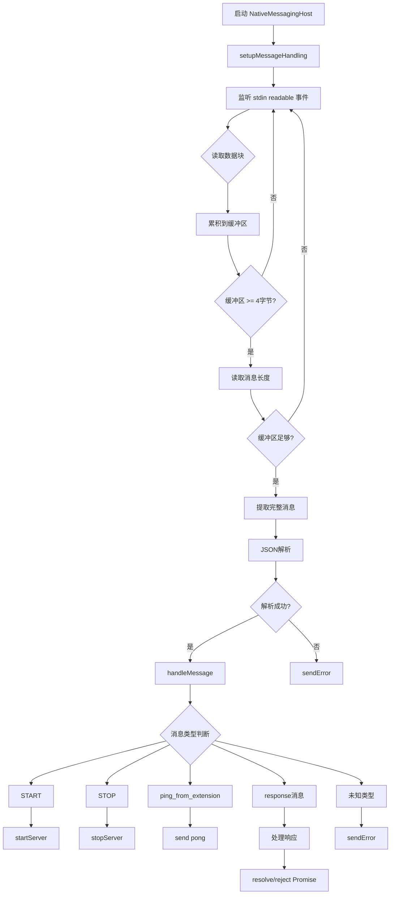
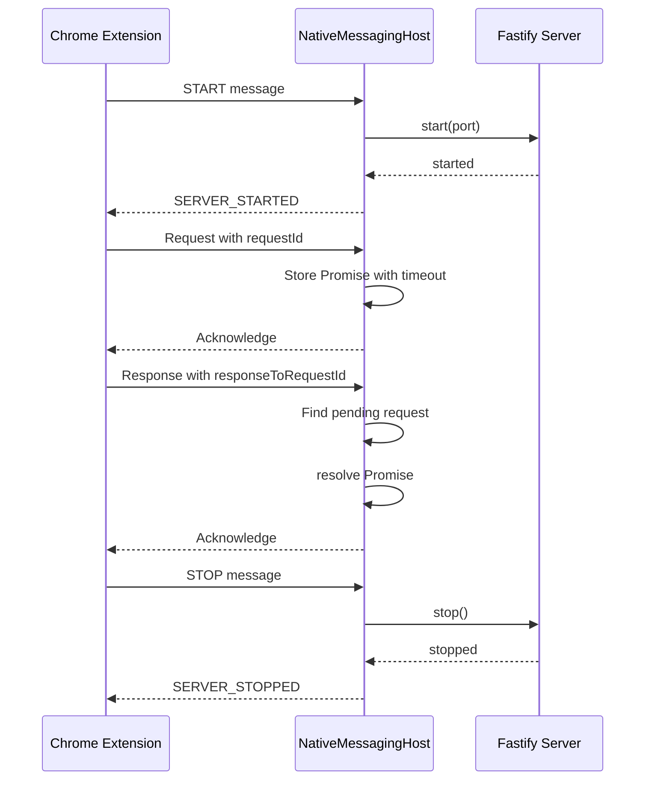
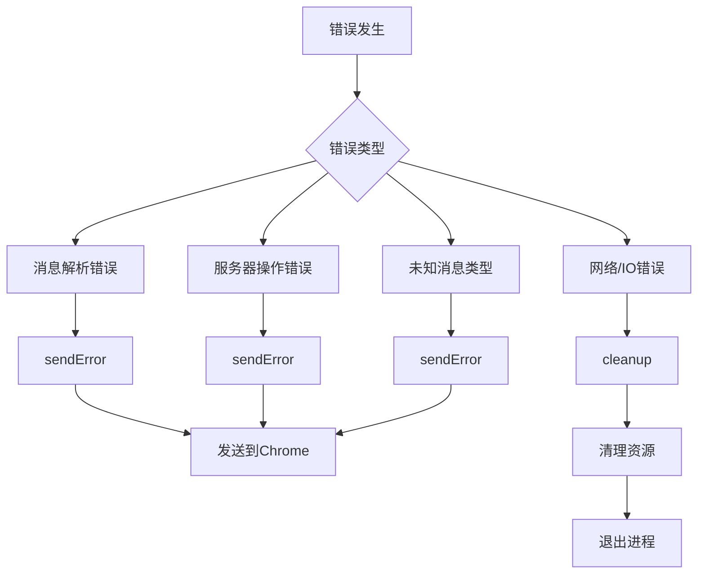

# Native Messaging Host 详细分析报告

## 文件概述

`native-messaging-host.ts` 是一个关键的 TypeScript 文件，负责现 Chrome 扩展与本地 Node.js 服务器之间的原生消息通信。该文件作为 Chrome 扩展的本地主机，通过标准输入/输出流与 Chrome 扩展进行通信，并管理 Fastify 服务器的启动和停止。

## 核心类结构

### 类定义：NativeMessagingHost

```typescript
export class NativeMessagingHost {
  private associatedServer: Server | null = null;
  private pendingRequests: Map<string, PendingRequest> = new Map();
}
```

#### 属性详解

1. **associatedServer**: `Server | null`
   - 关联的 Fastify 服务器实例
   - 通过 `setServer()` 方法设置
   - 用于启动/停止服务器服务

2. **pendingRequests**: `Map<string, PendingRequest>`
   - 存储待处理的请求映射
   - 键：请求ID (UUID)
   - 值：包含 resolve/reject/timeoutId 的 PendingRequest 对象

#### 接口定义：PendingRequest

```typescript
interface PendingRequest {
  resolve: (value: any) => void;
  reject: (reason?: any) => void;
  timeoutId: NodeJS.Timeout;
}
```

## 核心方法分析

### 1. 生命周期管理

#### start() 方法

```typescript
public start(): void {
  try {
    this.setupMessageHandling();
  } catch (error: any) {
    process.exit(1);
  }
}
```

- **功能**：启动消息处理循环
- **错误处理**：捕获任何异常并退出进程
- **调用时机**：由外部调用者（通常是主程序）触发

### 2. 消息处理机制

#### setupMessageHandling() 方法

这是最核心的方法，实现了 Chrome 原生消息协议：

**协议格式**：

- 每条消息前4字节表示消息长度（小端字节序）
- 后续字节为 JSON 格式的消息内容

**缓冲区处理逻辑**：

```typescript
private setupMessageHandling(): void {
  let buffer = Buffer.alloc(0);
  let expectedLength = -1;

  stdin.on('readable', () => {
    let chunk;
    while ((chunk = stdin.read()) !== null) {
      buffer = Buffer.concat([buffer, chunk]);

      if (expectedLength === -1 && buffer.length >= 4) {
        expectedLength = buffer.readUInt32LE(0);
        buffer = buffer.slice(4);
      }

      if (expectedLength !== -1 && buffer.length >= expectedLength) {
        const messageBuffer = buffer.slice(0, expectedLength);
        buffer = buffer.slice(expectedLength);

        try {
          const message = JSON.parse(messageBuffer.toString());
          this.handleMessage(message);
        } catch (error: any) {
          this.sendError(`Failed to parse message: ${error.message}`);
        }
        expectedLength = -1;
      }
    }
  });
}
```

#### handleMessage() 方法

处理解析后的消息，分为两大分支：

```typescript
private async handleMessage(message: any): Promise<void> {
  if (!message || typeof message !== 'object') {
    this.sendError('Invalid message format');
    return;
  }

  // 分支1：响应消息（responseToRequestId存在）
  if (message.responseToRequestId) {
    const requestId = message.responseToRequestId;
    const pending = this.pendingRequests.get(requestId);

    if (pending) {
      clearTimeout(pending.timeoutId);
      if (message.error) {
        pending.reject(new Error(message.error));
      } else {
        pending.resolve(message.payload);
      }
      this.pendingRequests.delete(requestId);
    }
    return;
  }

  // 分支2：指令消息（需要处理的消息）
  try {
    switch (message.type) {
      case NativeMessageType.START:
        await this.startServer(message.payload?.port || 3000);
        break;
      case NativeMessageType.STOP:
        await this.stopServer();
        break;
      case 'ping_from_extension':
        this.sendMessage({ type: 'pong_to_extension' });
        break;
      default:
        this.sendError(`Unknown message type: ${message.type || 'no type'}`);
    }
  } catch (error: any) {
    this.sendError(`Failed to handle directive message: ${error.message}`);
  }
}
```

### 3. 请求-响应模式

#### sendRequestToExtensionAndWait() 方法

实现异步请求-响应模式：

```typescript
public sendRequestToExtensionAndWait(
  messagePayload: any,
  messageType: string = 'request_data',
  timeoutMs: number = TIMEOUTS.DEFAULT_REQUEST_TIMEOUT,
): Promise<any> {
  return new Promise((resolve, reject) => {
    const requestId = uuidv4();

    const timeoutId = setTimeout(() => {
      this.pendingRequests.delete(requestId);
      reject(new Error(`Request timed out after ${timeoutMs}ms`));
    }, timeoutMs);

    this.pendingRequests.set(requestId, { resolve, reject, timeoutId });

    this.sendMessage({
      type: messageType,
      payload: messagePayload,
      requestId: requestId,
    });
  });
}
```

### 4. 服务器管理

#### startServer() 方法

```typescript
private async startServer(port: number): Promise<void> {
  if (!this.associatedServer) {
    this.sendError('Internal error: server instance not set');
    return;
  }

  if (this.associatedServer.isRunning) {
    this.sendMessage({
      type: NativeMessageType.ERROR,
      payload: { message: 'Server is already running' },
    });
    return;
  }

  await this.associatedServer.start(port, this);

  this.sendMessage({
    type: NativeMessageType.SERVER_STARTED,
    payload: { port },
  });
}
```

#### stopServer() 方法

```typescript
private async stopServer(): Promise<void> {
  if (!this.associatedServer) {
    this.sendError('Internal error: server instance not set');
    return;
  }

  if (!this.associatedServer.isRunning) {
    this.sendMessage({
      type: NativeMessageType.ERROR,
      payload: { message: 'Server is not running' },
    });
    return;
  }

  await this.associatedServer.stop();
  this.sendMessage({ type: NativeMessageType.SERVER_STOPPED });
}
```

### 5. 消息发送机制

#### sendMessage() 方法

```typescript
public sendMessage(message: any): void {
  try {
    const messageString = JSON.stringify(message);
    const messageBuffer = Buffer.from(messageString);
    const headerBuffer = Buffer.alloc(4);
    headerBuffer.writeUInt32LE(messageBuffer.length, 0);

    stdout.write(Buffer.concat([headerBuffer, messageBuffer]), (err) => {
      if (err) {
        // 错误处理逻辑
      }
    });
  } catch (error: any) {
    // 捕获序列化或缓冲区操作错误
  }
}
```

### 6. 错误处理

#### sendError() 方法

```typescript
private sendError(errorMessage: string): void {
  this.sendMessage({
    type: NativeMessageType.ERROR_FROM_NATIVE_HOST,
    payload: { message: errorMessage },
  });
}
```

### 7. 资源清理

#### cleanup() 方法

```typescript
private cleanup(): void {
  // 清理所有待处理请求
  this.pendingRequests.forEach((pending) => {
    clearTimeout(pending.timeoutId);
    pending.reject(new Error('Native host is shutting down or Chrome disconnected.'));
  });
  this.pendingRequests.clear();

  // 停止服务器
  if (this.associatedServer && this.associatedServer.isRunning) {
    this.associatedServer.stop()
      .then(() => process.exit(0))
      .catch(() => process.exit(1));
  } else {
    process.exit(0);
  }
}
```

## 消息类型定义

从代码中推断的消息类型：

### 从 Chrome 扩展接收的消息类型：

- **START**: 启动服务器
- **STOP**: 停止服务器
- **ping_from_extension**: 心跳检测

### 发送到 Chrome 扩展的消息类型：

- **SERVER_STARTED**: 服务器已启动
- **SERVER_STOPPED**: 服务器已停止
- **ERROR**: 错误消息
- **ERROR_FROM_NATIVE_HOST**: 本地主机错误
- **pong_to_extension**: 心跳响应

## 流程图

### 1. 整体消息处理流程



### 2. 请求-响应流程



### 3. 错误处理流程



## 设计模式分析

### 1. 观察者模式

- 使用 Node.js 的 EventEmitter 监听 stdin 事件
- 注册 readable/end/error 事件处理器

### 2. Promise 模式

- 使用 Promise/async-await 处理异步操作
- 通过 Map 存储 Promise 的 resolve/reject 函数

### 3. 状态机模式

- 服务器状态：运行中/已停止
- 消息状态：待处理/已响应/超时

### 4. 协议模式

- 实现 Chrome 原生消息协议
- 使用长度前缀+JSON负载的消息格式

## 安全性考虑

1. **输入验证**：
   - 验证消息格式和类型
   - JSON解析错误处理

2. **资源管理**：
   - 超时机制防止挂起
   - 清理机制确保资源释放

3. **错误隔离**：
   - 单个消息错误不影响整体系统
   - 优雅降级和错误报告

## 性能优化

1. **缓冲区管理**：
   - 动态缓冲区增长
   - 及时清理已处理数据

2. **内存管理**：
   - 使用 Map 存储待处理请求
   - 及时清理超时和已完成的请求

3. **异步处理**：
   - 非阻塞 I/O 操作
   - Promise 链式处理

## 使用场景

1. **Chrome 扩展开发**：
   - 需要与本地 Node.js 服务通信
   - 浏览器与本地系统的桥梁

2. **跨平台应用**：
   - 浏览器作为前端界面
   - Node.js 作为后端服务

3. **系统集成**：
   - 访问本地文件系统
   - 调用本地 API 和服务

## 总结

`native-messaging-host.ts` 是一个设计精良的 Chrome 原生消息通信实现，它通过标准输入输出流与 Chrome 扩展进行通信，管理 Fastify 服务器的生命周期，并提供了可靠的请求-响应机制。代码结构清晰，错误处理完善，适合作为浏览器与本地服务通信的基础架构。
